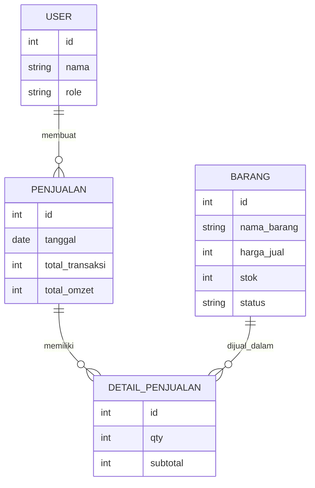
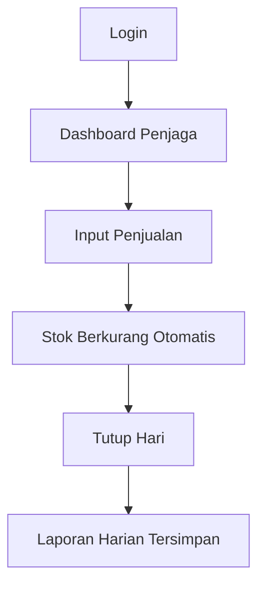
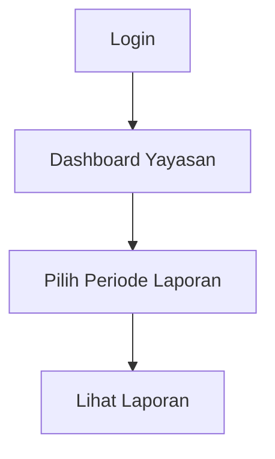

# ERD — Aplikasi Kantin Sekolah

Dokumen ini berisi **ERD konseptual + diagram visual** serta **alur aplikasi (app flow)** untuk Aplikasi Kantin SD / SD Islam.

---

## 🧩 ENTITY RELATIONSHIP DIAGRAM (ERD)

### 👤 Entity: User
- id
- nama
- role (penjaga / yayasan)
- credential

### 📦 Entity: Barang
- id
- nama_barang
- harga_jual
- stok
- status (aktif / nonaktif)

### 🧾 Entity: Penjualan
- id
- tanggal
- user_id
- total_transaksi
- total_omzet

### 📑 Entity: Detail_Penjualan
- id
- penjualan_id
- barang_id
- qty
- subtotal

---

## 🔗 RELASI ANTAR ENTITY

- **User** 1 → * **Penjualan**
- **Penjualan** 1 → * **Detail_Penjualan**
- **Barang** 1 → * **Detail_Penjualan**

Catatan penting:
- Laporan **tidak disimpan** sebagai tabel
- Laporan dihitung dari data **Penjualan + Detail_Penjualan** berdasarkan periode

---

## 📊 DIAGRAM ERD (VISUAL – MERMAID)

---

# 🧭 APP FLOW DIAGRAM (VISUAL)

## 👩‍🍳 Flow — Penjaga Kantin

---

## 🧑‍💼 Flow — Yayasan / Admin

---

## ✅ PRINSIP DESAIN DATA & FLOW

- Satu hari = satu rangkaian penjualan
- Penjaga **tidak bisa mengubah** data setelah Tutup Hari
- Yayasan **read-only**
- Semua laporan diturunkan dari data transaksi (single source of truth)

---

Dokumen ini menjadi **acuan visual utama** untuk:
- pengembangan Antigravity
- validasi logika aplikasi
- komunikasi dengan non-teknis (yayasan / penjaga)

